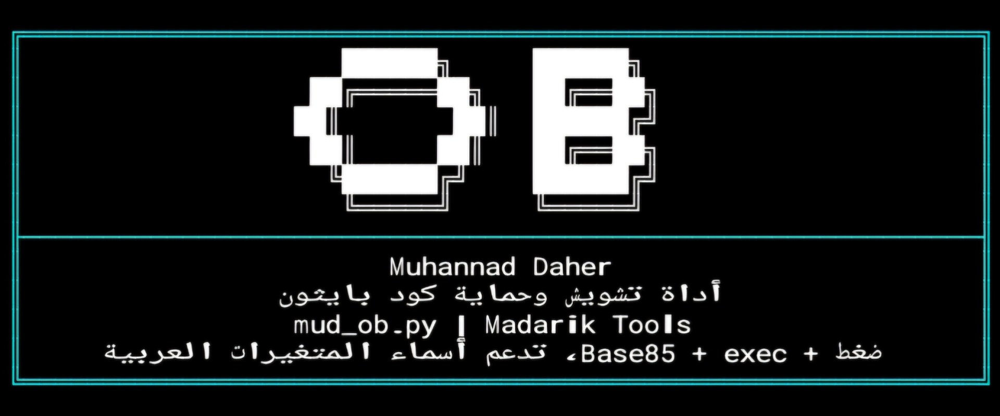
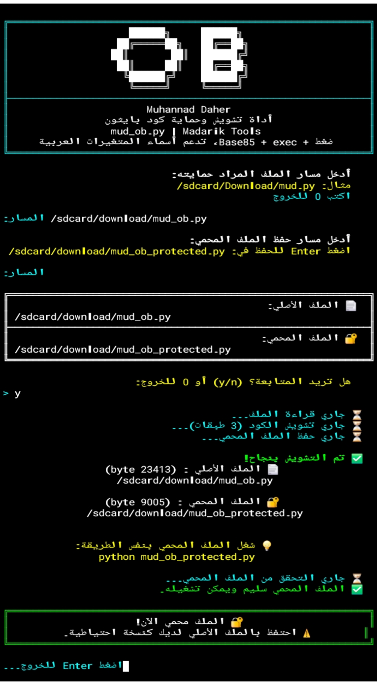

<div align="center">

  # 🔐 Python Obfuscator<br>أداة تشويش وحماية كود بايثون

By: **Muhannad Daher**

---

<div align="center">
  
[](https://github.com/mmuhacker/obfuscator/blob/main/LICENSE.md)<br>
[](https://github.com/mmuhacker/obfuscator/blob/main/LICENSE.md)<br>
[](https://github.com/mmuhacker)<br>
<br>
<br>
<br>
<br>
<br>
[](https://github.com/mmuhacker)

</div>

---

**📚 المحتويات**
</div>


- [📌 ما هي الأداة ؟](#ما_هي)
- [⚙️ كيف تعمل؟](#كيف)
- [📋 المتطلبات](#-المتطلبات)
- [لقطات الأداة](#لقطات)
- **🚀 التثبيت**
  - [تطبيق 🤖 Termux (Android)](#-termux-android)
  - [توزيعات 🐧 Linux](#لينكس)
- [تحديث الأداة](#تحديث)
- [▶️ طريقة الاستخدام](#طريقة)
- [📁 هيكل الملفات](#-هيكل-الملفات)
- [💡 ملاحظات مهمة](#-ملاحظات-مهمة)
- [👨‍💻 المطوّر](https://github.com/mmuhacker/obfuscator/blob/main/README.md#%E2%80%8D-%D8%A7%D9%84%D9%85%D8%B7%D9%88%D9%91%D8%B1)
- [الرخصة](#رخصة)

---

<div align="center" id="ما_هي">

## 📌 ما هي الأداة ؟

**Python Obfuscator**
هي أداة سطر أوامر مكتوبة بلغة Python تقوم بتشويش وحماية ملفات `.py` من القراءة والسرقة، مع الحفاظ على عملها بشكل طبيعي تماماً.

---

<div align="center" id="كيف">

## ⚙️ كيف تعمل؟

</div>

تعتمد الأداة على **3 طبقات حماية**:

| الطبقة | العملية |
|--------|---------|
| الأولى | ضغط الكود باستخدام `zlib` بأقصى مستوى |
| الثانية | تشفير الناتج بـ `Base85` |
| الثالثة | تقطيع الكود إلى أجزاء + توليد أسماء متغيرات عشوائية |

الملف المحمي يعمل بشكل طبيعي ولا يمكن قراءته أو فهمه دون فك التشويش.

---

## 📋 المتطلبات
</div>

- حزمة Python 3.x
- مكتبة `arabic-reshaper` (لعرض النصوص العربية)
- مكتبة `python-bidi` (لعرض النصوص العربية)

---

<div align="center" id="لقطات">
  
## 📸 لقطات الأداة 

</div>

<p align="center">
  <br>
  <em>الشكل 1: واجهة البانر الرئيسية</em>
</p><br>
<p align="center">
  <br>
  <em>الشكل 2: لقطة شاملة للأداة</em>
</p><br>
  
<div align="center">

**🚀 التثبيت**

## 🤖 Termux (Android)
</div>


**1. تحديث الحزم**

```bash
pkg update && pkg upgrade -y
```

**2. تثبيت Python**
```bash
pkg install python -y
```
**3. تثبيت المكتبات المطلوبة**
```bash
pip install arabic-reshaper python-bidi
```

**4. تحميل الأداة مباشرة**
```bash
curl -o $PREFIX/bin/ob https://raw.githubusercontent.com/mmuhacker/obfuscator/main/mud_ob.py
```

**5. منح صلاحية التنفيذ**
```bash
chmod +x $PREFIX/bin/ob
```

**6. الآن يمكنك تشغيلها من أي مكان:**
```
ob
```

---

<div align="center" id="لينكس">

## 🐧 Linux os

</div>

**1. تحديث النظام**
```bash
sudo apt update && sudo apt upgrade -y
```

**2. التحقق من Python (مثبت افتراضياً)**
```bash
python3 --version
```

**3. تثبيت pip إذا لم يكن موجوداً**
```bash
sudo apt install python3-pip -y
```

**4. تثبيت المكتبات المطلوبة**
```bash
pip3 install arabic-reshaper python-bidi
```

**5. تحميل الأداة مباشرة**
```bash
sudo curl -o /usr/local/bin/ob https://raw.githubusercontent.com/mmuhacker/obfuscator/main/mud_ob.py
```

**6. منح صلاحية التنفيذ**
```bash
sudo chmod +x /usr/local/bin/ob
```

**7. الآن يمكنك تشغيلها من أي مكان:**
```
ob
```

---

<div align="center" id="تحديث">
  
## 🔄 تحديث الأداة

</div>

- **Termux**

```bash
curl -o $PREFIX/bin/ob https://raw.githubusercontent.com/mmuhacker/obfuscator/main/mud_ob.py
```

- **Linux**

```bash
sudo curl -o /usr/local/bin/ob https://raw.githubusercontent.com/mmuhacker/obfuscator/main/mud_ob.py
```

---

<div align="center" id="طريقة">

## ▶️ طريقة الاستخدام

**تشغيل مباشر (بدون تثبيت):**

**Termux**

</div>

```bash
python mud_ob.py
```

<div align="center">
  
**Kali Linux**

</div>

```bash
python3 mud_ob.py
```

<div align="center">
  
**تشغيل كأمر عالمي (بعد التثبيت):**
```bash
ob
```

---


### خطوات الاستخدام:


| الخطوة | العملية |
|---|---------|
| ١. | تشغيل الأداة |
| ٢. | أدخل مسار الملف المراد حمايته |
| مثال: | /sdcard/Download/myapp.py |
| ٣. | أدخل مسار حفظ الملف المحمي |
| أو اضغط Enter | للحفظ تلقائياً بجانب الملف الأصلي |
| ٤. | أكّد بـ y للبدء |
| ٥. | ستجد الملف المحمي جاهزاً باسم: |
| مثال | myapp_protected.py |
| ٦. | إضغط Enter للخروج |

---

## 📁 هيكل الملفات

</div>

```
mud_ob.py     ← الأداة الرئيسية
img           ← صور و لقطات الأداة
LICENSE..md   ← الرخصة
README.md     ← هذا الملف
```

---
<div align="center">
  
## 💡 ملاحظات مهمة
</div>

- ✅ الملف المحمي يعمل بنفس طريقة الأصلي تماماً
- ✅ يدعم كل ملفات Python 3
- ⚠️ احتفظ دائماً بنسخة من الملف الأصلي
- ⚠️ التشويش لا يعني التشفير الكامل — هو حماية من القراءة السريعة

---
<div align="center">

## 👨‍💻 المطوّر

**Muhannad Daher**

[](https://github.com/mmuhacker)

</div>

---


<div align="center" id="رخصة">

## 📜 الرخصة

</div>

هذا المشروع مرخّص بموجب رخصة مدارك تولز — النسخ والتوزيع بدون تعديل مع ذكر المصدر.

بالمختصر:

- ✅ مسموح: نسخ الأداة كاملة غير معدلة، واستخدامها، وإعادة توزيعها، مع ذكر المصدر ورابط المستودع
- ❌ ممنوع: تعديل الكود أو توزيع نسخة معدّلة منه، أو ادعاء ملكيته

راجع ملف [LICENSE](https://github.com/mmuhacker/obfuscator/blob/main/LICENSE.md) للنص الكامل.

---


- أداة تشفير أكواد Python بثلاث طبقات
- البيئة: Termux (Android) و توزيعات Linux 
- الإصدار: v1.0


---
<div align="center">

*حافظ على كودك، حافظ على عملك.*

***Madarik Tools — صُنع بالعربية***

⭐ **إذا أعجبتك الأداة، لا تنسَ النجمة!** ⭐
</div>

---
